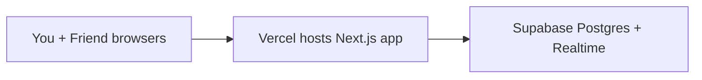

# Flashcards

A minimal shared flashcard webapp. Create a deck, share the link with a friend, and study together in real time.

## Architecture



| Layer | What it does |
| --- | --- |
| **Next.js (App Router)** | UI for creating decks, flipping cards, adding cards |
| **Supabase** | Stores decks + flashcards, syncs changes live between browsers |
| **GitHub** | Source code + collaboration |
| **Vercel** | Free hosting, auto-deploys when you push to GitHub |

## Local setup

### 1. Supabase (one-time)

1. Go to [supabase.com](https://supabase.com) and create a free project.
2. Open **SQL Editor** → **New query**.
3. Paste the contents of [`supabase/schema.sql`](./supabase/schema.sql) and click **Run**.
4. Go to **Project Settings → API** and copy:
   - Project URL → `NEXT_PUBLIC_SUPABASE_URL`
   - `anon` public key → `NEXT_PUBLIC_SUPABASE_ANON_KEY`

### 2. Environment variables

```bash
cp .env.example .env.local
```

Fill in your Supabase values in `.env.local`.

### 3. Run locally

```bash
npm install
npm run dev
```

Open [http://localhost:3000](http://localhost:3000).

## Deploy to Vercel

1. Push this repo to GitHub (see below if not done yet).
2. Go to [vercel.com/new](https://vercel.com/new).
3. **Import** your GitHub repo.
4. Add environment variables (same as `.env.local`):
   - `NEXT_PUBLIC_SUPABASE_URL`
   - `NEXT_PUBLIC_SUPABASE_ANON_KEY`
5. Click **Deploy**.

Every push to `main` will auto-deploy. Share the Vercel URL with your friend — e.g. `https://flashcards-abc.vercel.app/deck/biology-midterm`.

## Share with your friend (code + app)

### Use the live app

Send them a deck link: `https://your-app.vercel.app/deck/your-deck-name`

Anyone with the link can view cards and add new ones. Changes appear live for both of you.

### Collaborate on code

1. On GitHub, open your repo → **Settings → Collaborators → Add people**.
2. Enter your friend's GitHub username and send the invite.
3. They accept, then clone and run locally:

```bash
git clone https://github.com/YOUR_USERNAME/flashcards.git
cd flashcards
cp .env.example .env.local
# fill in Supabase keys (same project = same shared data)
npm install
npm run dev
```

They can push changes; Vercel redeploys automatically.

## How sharing works

- Deck names become URL slugs (`Biology midterm` → `/deck/biology-midterm`).
- Same name = same deck. Both of you type the same deck name or use the share link.
- Supabase Realtime keeps cards in sync without refreshing.

## Project structure

```
src/
  app/
    page.tsx              # Home — create or open a deck
    deck/[slug]/page.tsx  # Deck view
  components/
    FlashcardViewer.tsx   # Flip, navigate, add cards
  lib/
    supabase.ts           # Supabase client
    types.ts
supabase/
  schema.sql              # Database tables + policies
```

## Notes

- This uses open RLS policies for simplicity (anyone with the link can read/write). Fine for a private study deck between friends; add auth later if you need it.
- Never commit `.env.local` — it is gitignored.
